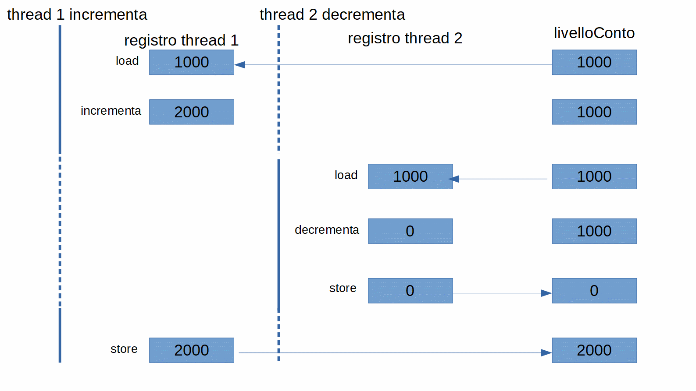

# Progetto BankAccount Azianda Dipendente

Creare un progetto Java con 3 classi:  
**Account** : rappresenta il conto corrente di un utente dove è possibile effettuare 3 operazioni:
- versare del denaro
- prelevarlo
- avere il saldo

**Company** : è una classe Thread che rappresenta l'azienda per la quale l'utente lavora.  
  All'interno di run() creare un ciclo di 100 iterazioni nel quale per ogni iterazione
  viene aggiunta una somma di 1000€ sul conto passando al thread l'oggetto di tipo Account.  
**Bancomat** : è una classe Thread che rappresenta il bancomat dell'utente che ha bisogno di prelevare 
denaro.
  All'interno di run() creare un ciclo di 100 iterazioni nel quale per ogni iterazione
  viene sottratta una somma di 1000€ dal conto passando al thread l'oggetto di tipo Account

Partire con un bilancio iniziale di 1000€ e stampare il saldo del conto al termine del lavoro
dei due thread.
Quale sarà il risultato?

## Versione start

Classe applicazione, [org.example.start.Applicazione](./src/main/java/org/example/base/Application.java),
i thread [org.example.start.Azienda](./src/main/java/org/example/base/Azienda.java) e
[org.example.start.Bancomat](./src/main/java/org/example/base/Bancomat.java),
e la classe dell'account,
[org.example.start.BankAccount](./src/main/java/org/example/base/BankAccount.java), condiviso tra i due thread.

```java
package org.example.start;

public class BankAccount {
    private int livelloConto;

    public BankAccount() {
    }

    public BankAccount(int startLivelloConto) {
        deposita(startLivelloConto);
    }

    public void deposita(int quantita) {
        this.livelloConto += quantita;
    }

    public int prelava(int quantita) {
        this.livelloConto -= quantita;
        return this.livelloConto;
    }

    public synchronized int getLivelloConto() {
        return livelloConto;
    }

}
```
Provando più volte l'esecuzione si può notare che **ALCUNE VOLTE** il livello conto finale non è 1000 come ci si dovrebbe 
aspettare ma a volte è inferiore o superiore. 

Come fa alcune volte a terminare con un livello conto 0 e alcune volte 2000? 

Vediamo un flusso d'esecuzione che può portare a un risultato non corretto quando due thread
accedono a una variabile condivisa per modificarla: un thread incrementa di 1000 il `livelloConto` 
mentre l'altro lo decrementa di 1000. Alla fine dell'esecuzione dei due thread il `livelloConto` 
dovrebbe rimanere invariato.



## Versione base

La soluzione è sincronizzare l'accesso alla variabile condivisa tramite metodi `synchronized`: 
in questo modo un solo thread alla volta può eseguire l'operazione `increment` o `decrement`. 

Nella figura sotto si vede la differenza tra l'accesso alla variabile condivisa, se la variabile ha
metodi `synchronized` o no.


Classe applicazione, [org.example.base.Applicazione](./src/main/java/org/example/base/Application.java),
i thread [org.example.base.Azienda](./src/main/java/org/example/base/Azienda.java) e
[org.example.base.Bancomat](./src/main/java/org/example/base/Bancomat.java), 
e la classe dell'account, 
[org.example.base.BankAccount](./src/main/java/org/example/base/BankAccount.java), condiviso tra i due thread. 

```java
package org.example.base;

public class BankAccount {

    private int livelloConto;

    public BankAccount() {}

    public BankAccount(int startLivelloConto) {
        deposita(startLivelloConto);
    }

    public synchronized void deposita(int quantita) {
        this.livelloConto += quantita;
    }

    public synchronized int prelava(int quantita) {
        this.livelloConto -= quantita;
        return this.livelloConto;
    }

    public synchronized int getLivelloConto() {
        return livelloConto;
    }

}
```

Eseguendo l'esempio si può vedere che può seccedere che venda prelevato da BankAccount anche se 
sul conto non c'è disponibilità mandando il conto in negativo. Come fare per evitare questo, 
cioè che il thread Bancomat aspetti a prelevare finché sul conto c'è nuovamente disponibilità?

La versione sotto (avanzata) utilizza `wait()` e `notify()` per sincronizzare l'accesso 
all'oggeto condiviso di tipo `BanckAccount`.

## Versione avanzata

La nuova applicazione 
[org.example.advanced.Applicazione](./src/main/java/org/example/advanced/Application.java) con la versione
nuova di [org.example.advanced.BankAccount](./src/main/java/org/example/advanced/BankAccount.java).

```java
package org.example.advanced;

public class BankAccount {
    
    private int livelloConto;

    public BankAccount() {}

    public BankAccount(int startLivelloConto) {
        deposita(startLivelloConto);
    }

    public synchronized void deposita(int quantita) {
        this.livelloConto += quantita;
        notify();
    }

    public synchronized int prelava(int quantita) {
        while(this.livelloConto<quantita) {
            try {
                wait();
            } catch (InterruptedException e) {
                throw new RuntimeException(e);
            }
        }
        this.livelloConto -= quantita;
        return this.livelloConto;
    }

    public synchronized int getLivelloConto() {
        return livelloConto;
    }

}
```

In questo modo se il thread consumatore se cerca di prelevare i 1000 euro ma trova il livello del conto 
a 0 non preleva ma aspetta finché il produttore non deposita i 1000 euro. A questo punto il 
thread consumatore ritenta il prelievo.

